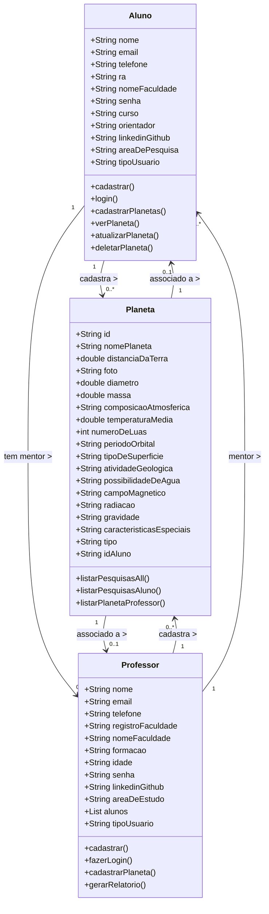
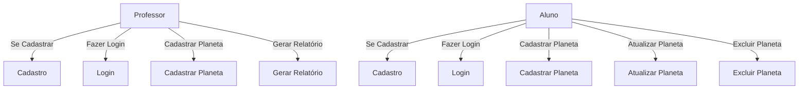
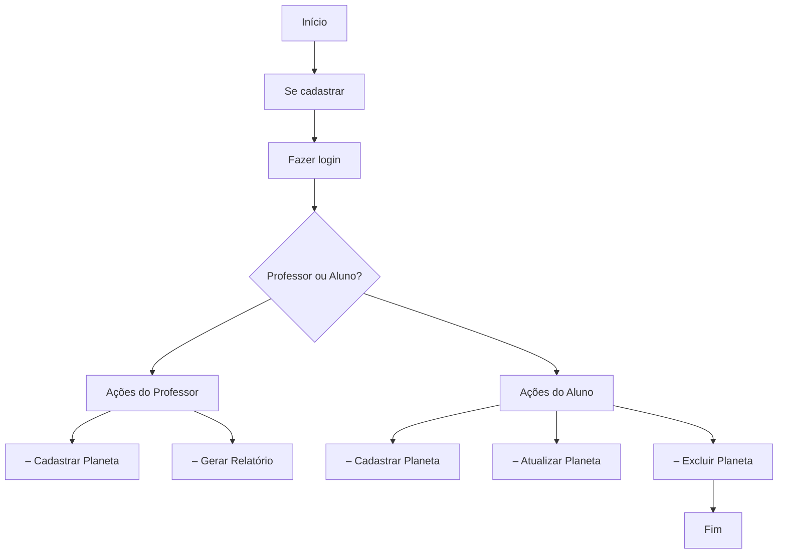
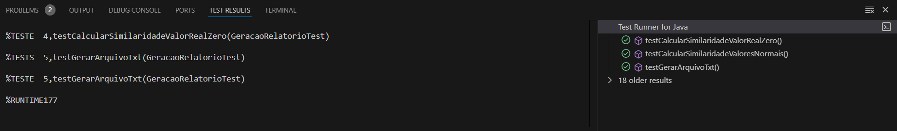
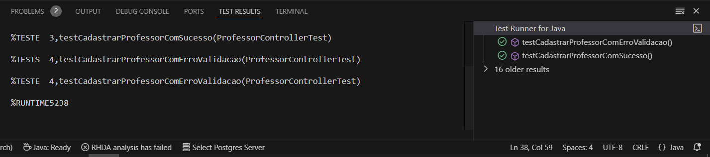
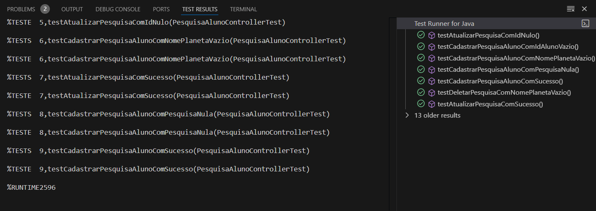
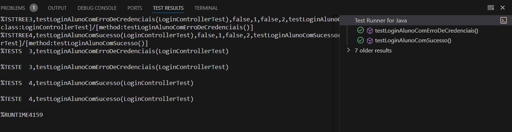
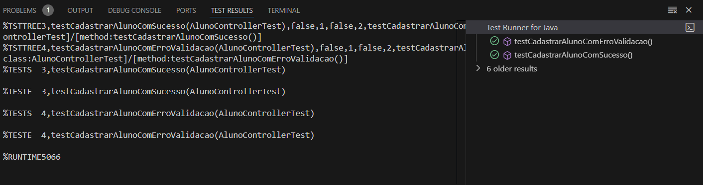

# PlanetaryResearch 🌌

**PlanetaryResearch** é uma aplicação educacional interativa desenvolvida em **Java** (utilizando **Swing**) com um banco de dados **MongoDB**. O sistema visa facilitar a pesquisa e o estudo de planetas por **professores** e **alunos/pesquisadores**, promovendo um ambiente acadêmico para o lançamento e validação de informações planetárias.

## Funcionalidades Principais

### 1. Página de Login e Cadastro
O sistema oferece login e cadastro diferenciados para **Professores** e **Alunos/Pesquisadores**:
- **Professor:**
  - Informações: Nome, Email, Telefone, Registro da Faculdade, Nome da Faculdade, Formação, Idade, Senha, Linkedin ou Github, Área de Estudo, Lista de Alunos.
  - Controle de orientandos: Professores podem cadastrar seus alunos para associá-los às suas pesquisas por meio do RA dos alunos.

- **Aluno/Pesquisador:**
  - Informações: Nome, Email, Telefone, RA, Nome da Faculdade, Senha, Curso, Orientador, Linkedin ou Github, Área de Pesquisa.

### 2. Funcionalidades para o Professor
- **Cadastro de Planetas:** O professor pode cadastrar planetas reais com informações como:
  - Nome do Planeta, Distância da Terra, Diâmetro, Massa, Composição Atmosférica, Número de Luas, etc.
- **Validação de Descobertas:** Professores podem comparar os planetas cadastrados pelos alunos com os planetas reais e gerar relatórios determinando a veracidade das descobertas.

### 3. Funcionalidades para o Aluno/Pesquisador
- **Cadastro de Novos Planetas:** Alunos podem cadastrar informações sobre planetas que acreditam ter descoberto, inserindo dados como:
  - Nome, Distância da Terra, Composição Atmosférica, Temperatura Média, Tipo de Superfície, etc.
- **API CRUD:** Alunos podem realizar operações de criar, visualizar, atualizar e deletar planetas por meio da API do sistema.

### 4. Relatório de Descoberta
- Após o envio das informações, o professor pode comparar os dados inseridos pelo aluno com planetas reais e gerar um relatório que determina se a descoberta do aluno corresponde a um novo planeta ou não.
- Futuramente, o sistema poderá contar com uma **IA** para realizar comparações automáticas e verificar a habitabilidade dos planetas.

## Diagrama de Navegação

1. **Página Inicial**: Escolha entre login para Professor ou Aluno/Pesquisador.
2. **Página de Cadastro**: Preenchimento de informações e registro no sistema.
3. **Página de Login**: Validação de credenciais (email/RA e senha) para acesso à plataforma.
4. **Página Interna do Aluno**:
   - Visualização de Planetas em Andamento (CARDS)
   - Cadastro de Novos Planetas
5. **Página Interna do Professor**:
   - Cadastro de Planetas Reais
   - Geração de Relatório sobre as descobertas dos Alunos
6. **Logout**: Opção disponível para ambos os tipos de usuário.

## Tecnologias Utilizadas
- **Java (JavaFX ou Swing)**
- **MongoDB** para gerenciamento de banco de dados
- **APIs** para comunicação entre alunos e professores

## Futuras Expansões
- Implementação de uma **IA** para validar planetas automaticamente.
- Função para verificar a habitabilidade de planetas cadastrados pelos alunos.

# Diagramas

 Diagrama de Classe

 

 Diagrama de Uso

 

 Diagrama de Fluxo

 

# Testes Unitários com Mockito 

  
 Testes Unitários

  - **Relatório Controller**  
  

  - **Professor Controller**  
  

  - **Pesquisa Controller**  
  

  - **Login Controller**  
  

  - **Aluno Controller**  
  

 

# Manual do Usuário

 Manual do Usuário - Sistema de Cadastro de Planetas 

## Funcionalidades

### Para Professores
- **Cadastro**: Professores podem se cadastrar no sistema fornecendo informações básicas.
- **Login**: Professores podem fazer login utilizando suas credenciais.
- **Cadastrar Planeta**: Professores têm a opção de cadastrar um planeta, incluindo detalhes como nome, tipo, e características.
- **Gerar Relatório**: Professores podem gerar um relatório comparativo entre um planeta real e o planeta cadastrado por um aluno.

### Para Alunos
- **Cadastro**: Alunos podem se cadastrar no sistema fornecendo informações básicas.
- **Login**: Alunos podem fazer login utilizando suas credenciais.
- **Cadastrar Planeta**: Alunos podem cadastrar um planeta que descobriram, inserindo informações detalhadas.
- **Atualizar Planeta**: Alunos têm a opção de atualizar as informações de um planeta que já cadastraram.
- **Excluir Planeta**: Alunos podem excluir um planeta do seu cadastro se desejarem.

## Como Usar

1. **Cadastro**: 
   - Acesse a opção de cadastro.
   - Preencha os campos obrigatórios e envie o formulário.

2. **Login**: 
   - Acesse a opção de login.
   - Insira suas credenciais (nome de usuário e senha).

3. **Ações**:
   - **Professores**: Após o login, você pode cadastrar planetas e gerar relatórios com base em Planetas existentes e os Planetas dos Aluno.
   - **Alunos**: Após o login, você pode cadastrar, atualizar e excluir planetas.
4. **Cadastro de Planetas**:
   - **Professores**: Pode cadastrar planetas existentes com base nos campos existentes para cadastro, após o cadastro do planeta ele aparecerá na tela de relatório como uma opção para a comparação do relatório.
   - **Alunos**: Podem Cadastrar, Visualizar, Editar e Deletar planetas. Após o envio do planeta ele irá aparecer para o professor na página de realatório, para posteriormente ser gerado um relatório.
5. **Geração de Relatórios**: O acesso é apenas para o Professor. Nessa tela aparecerá duas opções para selecionar, um campo com os planetas reais cadastrados pelo professor, e um campo com os planetas cadastrados pelos alunos. Ao selecionar dois dentres esses planetas e clicar em gerar relatório, um arquivo txt será gerado com o nome do planeta do aluno(os nomes dos planetas são únicos). No relatório será apresentado perspectivas de comparação entre os dois planetas e um nível de similaridade será apresentado.

